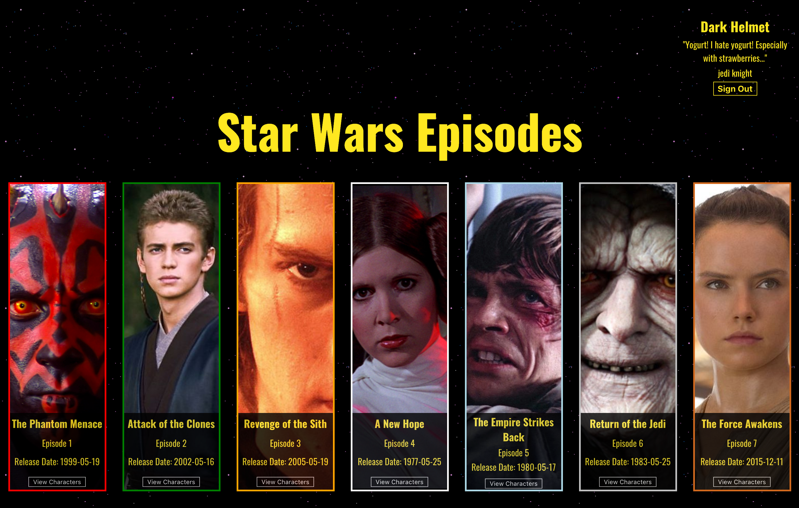

# SWAPI Trivia

A Star Wars application made my Pol Sieira and Jeannie Evans using React, SASS, and a Star Wars API for info. All files are accompanied by testing.

## About

This application allows the user to nerd out on all their favorite Star Wars Episodes and their characters. The user will be prompted to add their name, favorite SW quote and their level of Jedi mastery. Once complete, the user will salute 'May the force be with you' (ie click the button with that text), taking them to the movies page. The movies are in order of episode with an image from an iconic character. Viewing the characters takes the user to a new page with all characters from that movie and facts about them. These facts include other SW films they are in, where they are from, and more!

## Download the App

## Clone & Install

Clone down this repo in your terminal by running `git clone` followed by the link provided in the upper right hand corner of your screen.

Run `npm install`

### Run `npm start`

Open [http://localhost:3000](http://localhost:3000) to view it in the browser.

## ScreenShots

